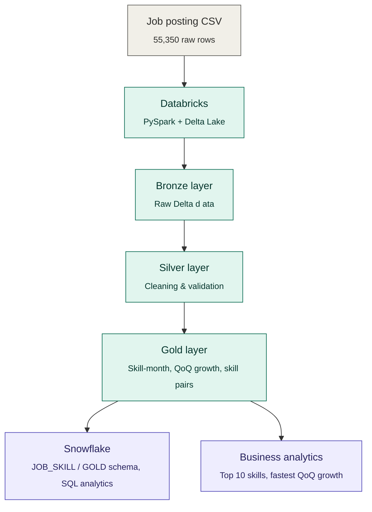

# SkillDemand360 — System Architecture

```mermaid
flowchart TD
    A["Job posting CSV<br/><sub>55,350 raw rows</sub>"] --> B["Databricks<br/><sub>PySpark + Delta Lake</sub>"]
    B --> C["Bronze layer<br/><sub>Raw Delta d ata</sub>"]
    C --> D["Silver layer<br/><sub>Cleaning &  validation</sub>"]
    D --> E["Gold layer<br/><sub>Skill-month, QoQ growth, skill pairs</sub>"]
    E --> F["Snowflake<br/><sub>JOB_SKILL / GOLD schema, SQL analytics</sub>"]
    E --> G["Business analytics<br/><sub>Top 10 skills, fastest QoQ growth</sub>"]

    classDef source fill:#F1EFE8,stroke:#5F5E5A,color:#2C2C2A;
    classDef pipeline fill:#E1F5EE,stroke:#0F6E56,color:#04342C;
    classDef output fill:#EEEDFE,stroke:#534AB7,color:#26215C;

    class A source;
    class B,C,D,E pipeline;
    class F,G output;
```
